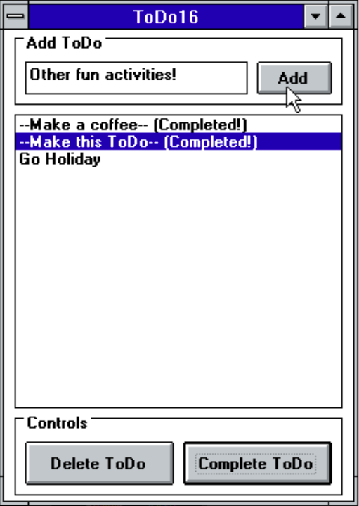
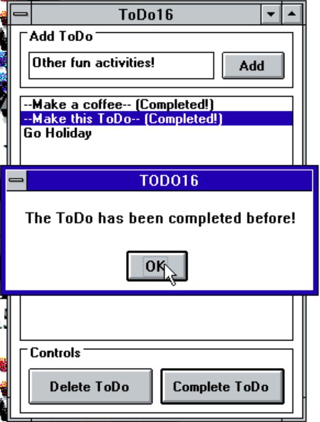
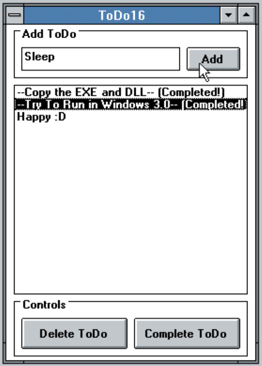
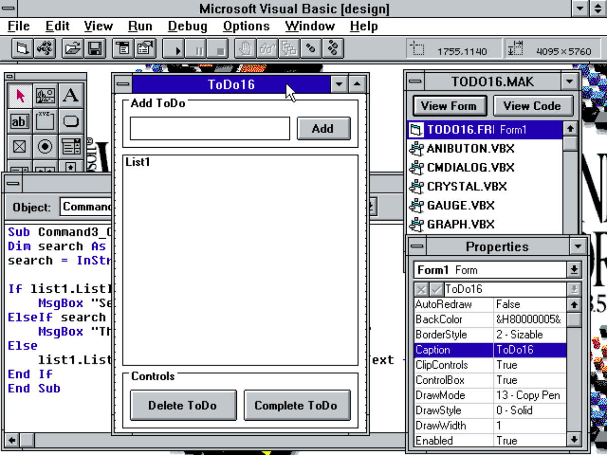

# ToDo16

 A Simple ToDo Application, made with Visual Basic 3.0 for 16-bit Windows OS :)

---

### Short Background

A very simple ToDo application made in Visual Basic 3.0 for those who wants to try developing apps on older Windows or just studying old development environtment, or even for people who still using 16-bit Windows OS (either on real PC or just for fun in Virtual Machine) and want to have a simple ToDo app.

Just like any other ToDo apps made for older Windows than Windows 10 and 11, this one breaks my own record by making it for really old Windows OS, especially the 16-bit Windows OS such as Windows 3.0 and up. Even though the code currently follows the ClassicToDo, but instead of just recompiling it on Visual Basic 3.0 from 6.0, the form itself is made from scratch in Visual Basic 3.0.

The app only tested in Windows 3.0, 3.11, NT 3.51 and XP and runs well on all tested systems. On Vista and newer, you must find a way to run 16-bit apps.

### Specifications

- 16-bit Windows operating system (Recommended 3.0 - 3.51. Windows 9x and XP could use my ClassicToDo instead) (Untested on Windows 1.x - 2.x)

- VBRUN300.DLL (included here)

### Features

Just a simple ToDo app that can:

- Add ToDo list

- Delete a ToDo

- Mark a ToDo as completed

Main goal is to make it as functional as my ToDo7, but limitations might apply in Visual Basic 3.0. Expect more updates in ClassicToDo than this one.

### Screenshots

_Pic 1. ToDo16 application view, running on Windows NT 3.51 on VMware._

_Pic 2. Same alerts as ClassicToDo applied in this release._

_Pic 3. ToDo16 running on Windows 3.0 using VMware._

_Pic 4. Visual Basic 3.0 environtment view._

### Downloads

Check on Release section :D

### Changelogs

##### v.1.0.1 - Minor Changes

- Fix BorderStyle to FixedSingle as it doesn't need to be resizable

- Fix some image errors in Readme.md file.

##### v.1.0.0 - Initial Release

The initial release of this ToDo16.

---

Feel free to contribute!
